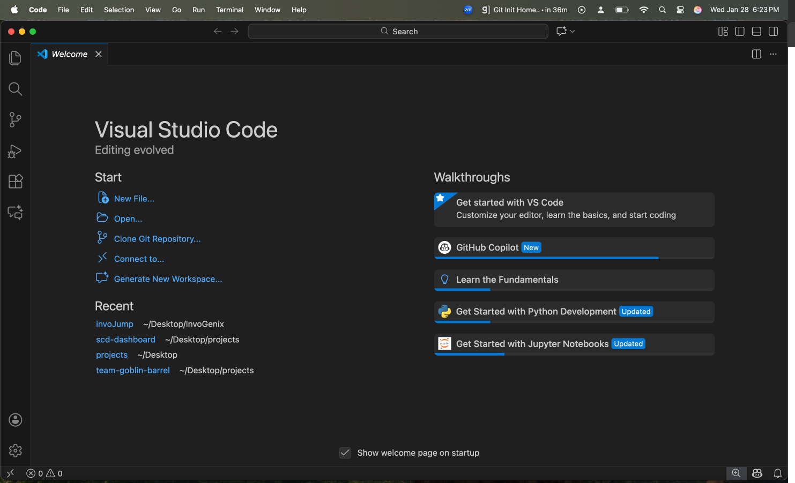

# Init IS310 Homework

## Proof of Installation

1. Python

2. Git

3. VS Code

4. AI Tool/Workflow 

How will you work with AI? What tools if any do you plan to use?

For this class, I expect to utilize AI to aid in my learning of the programming tasks that I have devised as necessary for my projects. Predominantly, I expect to query AI to explain how I could do small, low-level tasks for the project so that I understand the logical composition of my code and have control over the final product produced. I also expect to utilize it for debugging, cleaning data, and, more explicitly, generating code for creating data visualizations to the specifications I have in mind or have decided on with the team. I am not a huge fan of utilizing AI for writing tasks other than receiving some suggestions on grammatical edits (due to my tendency to write run-on and compound sentences) as I have read and felt how it can be detrimental to personal thought and capacity to express oneself through text. AI tools that I may use for these purposes include Google Gemini, ChatGPT, and Co-pilot. 

5. Hypothesis username
ananyakavatekar
