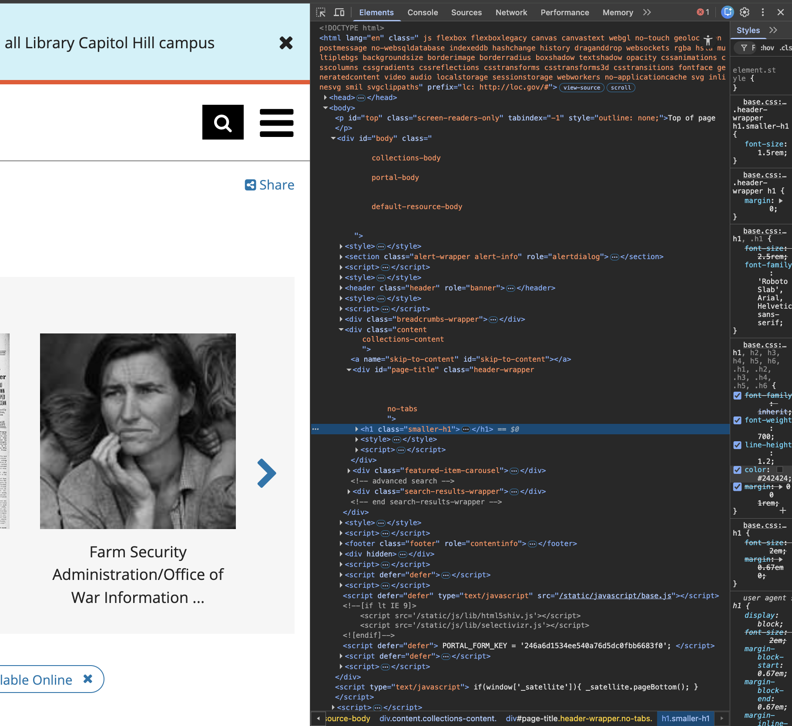
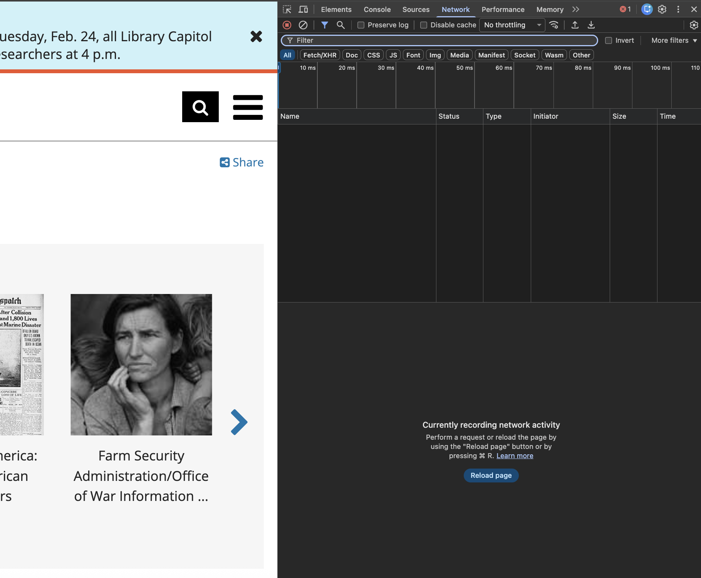

# Source and Style - Assignment 1 

## Website Analyzed 
Library of Congress - Digital Collections
https://www.loc.gov/collections/

## Web Technoloiges Used

By utilize Chrome's DevTools I was able to inspect the elements and styling of the site. 

I observed the following 

### HTML 

The site utilized "semantic" or descriptive HTML that highlighted key strcutures.
This included the following: 
- `<header>`
- `
`
- `<h1>`
- `<section>`

There is also enables accessibility features such as role="alertdialog" that allows for effective usage
of screen readers for the literary or visually impaired. 

### CSS 
The website utilizes external stylesheets which includes base.css that contains thousands 
of lines of styling rules for the site. 

### JavaScript
From the inspection we can clearly see embedded executable script tags within the HTML. 
These found the interactive functions of the website including:
- Dynamic content loading
- Content filtering based on user criteria   
- Carousel view and scrolling of content featured on the main page

### Additional File Types
The site also included:
- SVGs for the icons present 
- Web font files (.woff)
- JSON data responses for the search retrieval

### Built by

The website is for the Library of Congress which is a federal institute. 
Based on its complexity it is likely maintained by a multi-person digital services and engineering team. 

Given elements such as strucured metadata systems and collection APIs suggest collaboration between: 
- system architects 
- archivists
- software engineers
- designers 

## Screenshots

### HTML Structure (Elements Tab)

### Loaded CSS and JavaScript (Network Tab)

